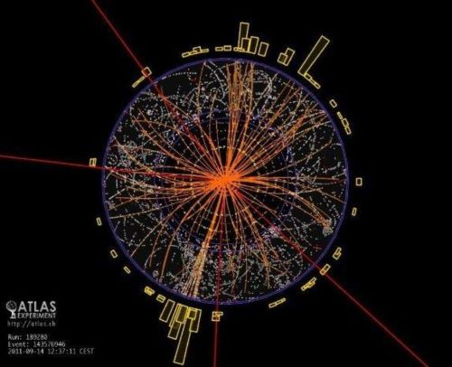

# Higgs_collaboration_A
Work Collaboration Higgs EL 1 A 

Thanks to Julie Agin, Antoine Ducournau, Victor Gueudelot,
Denis Le Monnier De Gouville, Maël Delaunay, Lina
Etcheverry, Romance Milonet, Paul Sylla, Marwan
Bakkouch, Chloé La Grée, Juefan Mathias Yuan,
Mohamed Reda Naini, Koské Roblot, Yiling Zhuang,
Léandre Jean, Thomas Vanderbeken, Yannis Carreau,
Nicolas Fagot, Lam Pla, Quentin Mininger, Jules
Molet, Suzie Jourdan, Baptiste Wintrebert, Mexy de
Goede, Fernanda Andréa Gutierrez

## Tests d'optimisation du réseau de neurones

Pour effectuer des tests d'optimisation sur le réseau de neurones créé, veuillez vous rendre sur la **branche NN_test_opti** :

bash
git checkout NN_test_opti

## Files to launch

## BDT Training

Launch the train_model.py file inside /sample_code_submision/BDT
